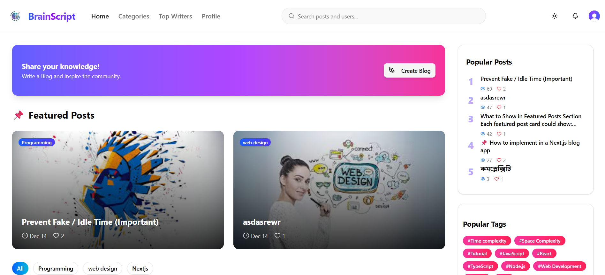
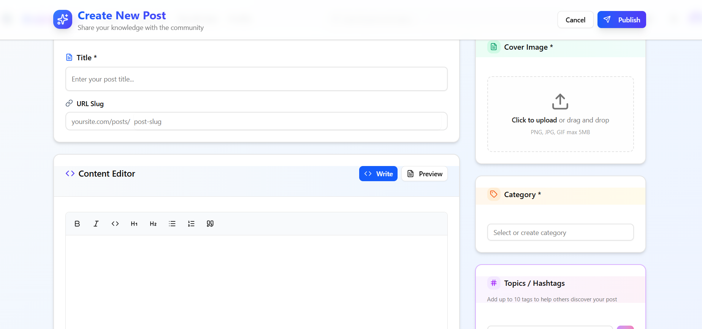
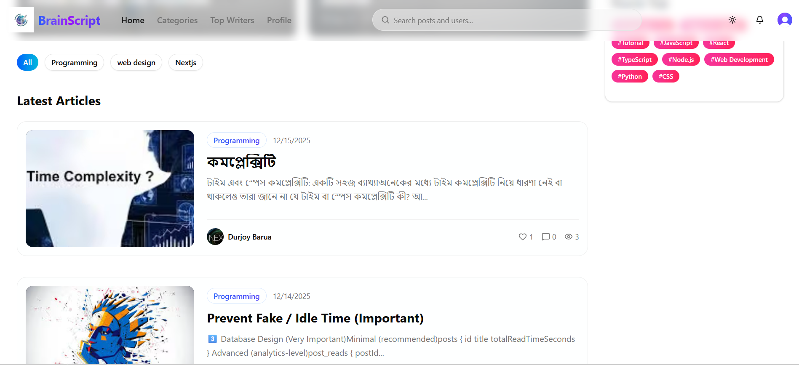
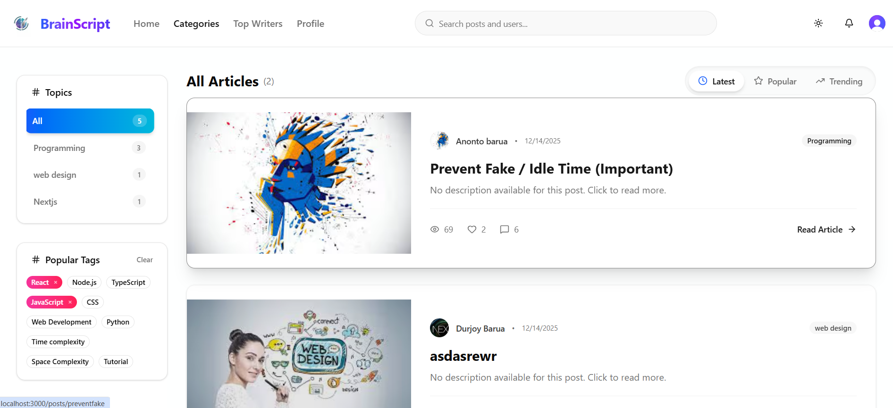
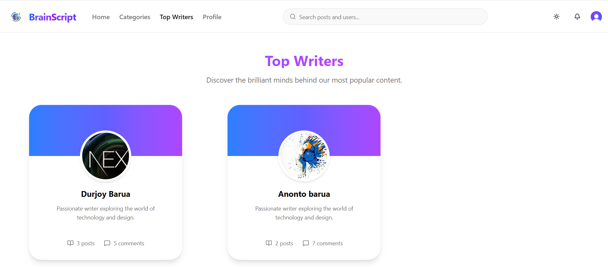
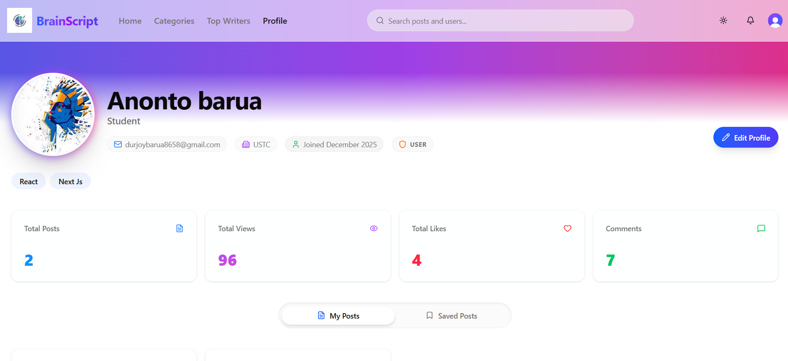

# 🧠 BrainScript - Modern Blogging Platform
<div align="center">
    <h3>Project Demo</h3>
<div style="display: grid; grid-template-columns: repeat(3, 1fr); gap: 10px; margin: 20px 0;">
    
    
    
    
    
    
    
    
</div>
</div>

A **full-stack modern blogging platform** designed to empower writers and readers.
BrainScript provides a seamless experience for creating rich content, engaging with the community through likes and comments, and managing your digital profile.

---

## 🚀 Project Overview

The system is powered by a modern tech stack:

1. **Backend**
   - Built with **Convex** (BaaS) for real-time data and serverless functions.
   - Handles authentication synchronization, database queries, and file storage.

2. **Frontend**
   - Built with **Next.js (v16)**, **React (v19)**, and **Tailwind CSS (v4)**.
   - Designed for performance and accessibility with a premium UI.

---

## 🗂️ Folder Structure

```
BrainScript/
├── convex/             # Backend functions and schema
├── Frontend/           # Next.js frontend application
│   ├── app/            # App router pages
│   ├── components/     # Reusable UI components
│   ├── public/         # Static assets and demos
│   └── ...
├── package.json        # Root dependencies and scripts
└── README.md           # Project documentation
```

---

## ⚙️ Backend Setup (Convex)

### 🧩 Features
- Real-time database updates
- Clerk Authentication integration
- Serverless API functions
- File storage for post images and avatars

### 🔧 Setup Instructions

1. **Install Dependencies**
   ```bash
   npm install
   ```

2. **Configure Environment**
   Ensure you have a Convex project set up.
   ```bash
   npx convex dev
   ```
   This command starts the Convex development server and syncs your functions.

---

## 💻 Frontend Setup (Next.js)

### 🧩 Features
- **Next.js 16** with Turbopack for lightning-fast dev
- **Clerk** for secure user management
- **Tiptap** rich text editor for writing posts
- **Shadcn UI** & **Tailwind CSS 4** for styling
- **React 19** features

### 🔧 Setup Instructions

You can run both Frontend and Backend concurrently from the root directory:

```bash
npm run dev
```

Or run the frontend independently:

```bash
npm run dev:frontend
```

The application will be available at:
```
http://localhost:3000
```

---

## 🔒 Authentication

This project uses **Clerk** for authentication.
- **Frontend:** `@clerk/nextjs`
- **Backend:** Integrated via Convex auth config.

---

## 🧾 Scripts Summary

| Command | Description |
|----------|--------------|
| `npm run dev` | Start both Frontend and Backend concurrently |
| `npm run dev:frontend` | Start Next.js frontend only |
| `npm run dev:backend` | Start Convex backend only |
| `npm run build` | Build the Next.js application |

---

## 🧑‍🏫 Author
**Durjoy Barua**
💻 Full Stack Developer
📧 [durjoybarua8115@gmail.com]

---

## 🪪 License
This project is licensed under the **ISC License**.

---

## 🌟 Acknowledgements
- [Convex](https://www.convex.dev/)
- [Clerk](https://clerk.com/)
- [Next.js](https://nextjs.org/)
- [Tailwind CSS](https://tailwindcss.com/)
- [Tiptap](https://tiptap.dev/)
